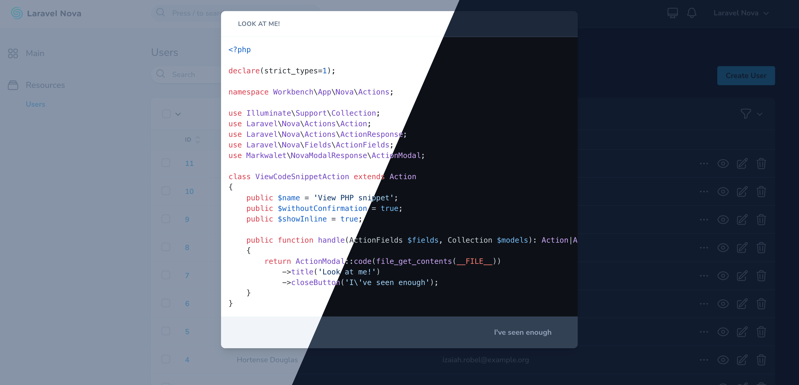

# Nova Modal Response

[](LICENSE.md)
[](https://packagist.org/packages/markwalet/nova-modal-response)
[](https://packagist.org/packages/markwalet/nova-modal-response)


Enabling custom modals for action responses in [Laravel Nova](https://nova.laravel.com).



More info for this specific feature can be found in the [Nova Documentation](https://nova.laravel.com/docs/4.0/actions/defining-actions.html#custom-modal-responses).

## Installation

```shell
composer require markwalet/nova-modal-response
```

## Usage

```php
use Markwalet\NovaModalResponse\ModalResponse;

ModalResponse::text('This is way better than that small notification in the bottom right!')
    ->title('Result in a modal');

// Modals can also be manually created in Nova
use Laravel\Nova\Actions\Action;

return Action::modal('modal-response', [
    'title' => 'Result in a model',
    'body' => 'This is way better than that small notification in the bottom right!',
]);
```

When you want to render raw html, you can use the `html` parameter instead:

```php
ModalResponse::html('<ul><li>Show this package to your friends</li><li>Contribute</li><li>???</li><li>Profit!</li></ul>');
```

There is also a special mode for rendering code snippets. This will surround the body with a `<pre>` and `<code>` tag but still leave escaping enabled. 


```php
ModalResponse::code(file_get_contents(__FILE__))->title('Look at me!');
```
Syntax highlighting is enabled by default for code and json blocks. It is using [highlight.js](https://highlightjs.org/) under the hood. You can disable this by calling `->withoutSyntaxHighlighting()`.

If you want to show some serializable data to the client, you can do that as well:

```php
ModalResponse::json([
    'lorem' => 'ipsum',
    'dolor' => [
        'sit',
        'amet',
    ],
]);
```

You can also specify the size using the `size` option:
```php
ModalResponse::text('Hello world')->size('7xl');
```
